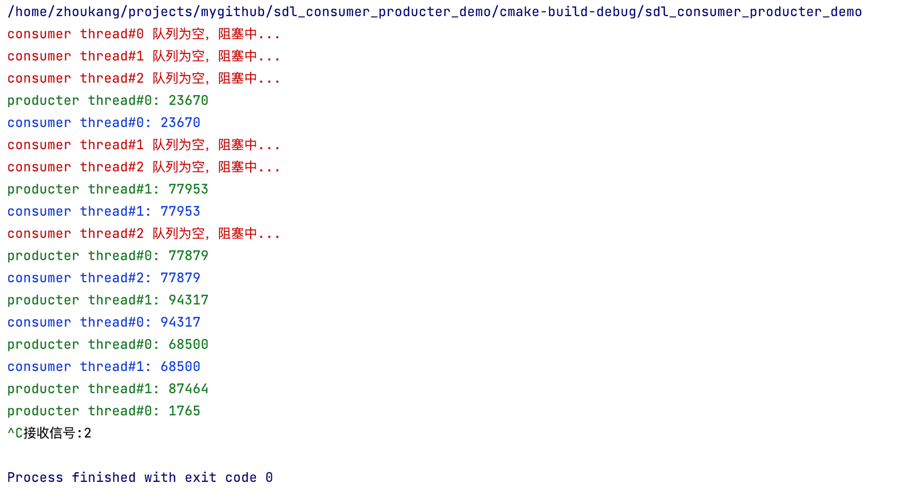

### 代码说明

```
2个生产者，3个消费者
生产者生产任务(生产0~100000之间随机整数)，并添加到任务队列中;
消费者从任务队列中获取任务，并执行任务
```

### 全局变量

```c++
// 任务队列，容量为10
IntDeque iq(10);
// 互斥锁，对任务队列上锁
SDL_mutex* mutex = nullptr;
// 条件变量，当任务队列为空时触发
SDL_cond* empty_cond = nullptr;
// 条件变量，当任务队列为满时触发
SDL_cond* full_cond = nullptr;
```

### 函数声明

```c++
/* 处理SIGINT信号，退出程序，完成资源清理工作
 * */
void process_exit(int sig);

/* 消费者线程
 * */
int consumer(void *arg);

/* 生产者线程
 * */
int producter(void *arg);
```

### 函数实现

#### int consumer(void *arg)

```c++
/* 消费者:
	 while(1):
	 		加锁
	 		while(队列为空):
	 			empty_cond条件变量触发，阻塞...
	 		取出任务
	 		解锁
	 		
	 		通知full_cond条件变量
	 		
	 		执行任务
 * */
int consumer(void *arg)
{
    while(true) {
       int val;
       // 加锁
        SDL_LockMutex(mutex);
        while(iq.Empty()) { // 判断队列是否为空
            printf(Print_Red"consumer thread#%d 队列为空，阻塞中...\n", threadIndex);
            SDL_CondWait(empty_cond, mutex);
        }
        val = iq.Pop();
        
        SDL_UnlockMutex(mutex);

        // 通知生产者
        SDL_CondBroadcast(full_cond);

        // 执行任务
        printf(Print_Blue"consumer thread#%d: %d\n", threadIndex, val);
        SDL_Delay(delay_time);
   }
    return (0);
}
```

#### int producter(void *arg)

```c++
/* 生产者:
    while(1):
        生产任务
        
        加锁
        while(队列为满):
          full_cond条件变量触发，阻塞...
        添加任务
        解锁
        
        通知empty_cond条件变量
 * */
int producter(void *arg)
{
    int threadIndex = (int)(long)arg;
    int delay_time = 300 + threadIndex * 100;

    while(true) {
        // 生产数据
        SDL_Delay(delay_time);
        int val = rand() % 100000;

        // 添加数据
        SDL_LockMutex(mutex);
        while(iq.Full()) { // 队列满
            printf(Print_Red"producter thread#%d 队列已满，阻塞中...\n", threadIndex);
            SDL_CondWait(full_cond, mutex);
        }
        printf(Print_Green"producter thread#%d: %d\n", threadIndex, val);
        iq.Push(val);
        SDL_UnlockMutex(mutex);

        // 通知消费者
        SDL_CondBroadcast(empty_cond);
    }
    return (0);
}
```

#### void process_exit(int sig)

```c++
void process_exit(int sig)
{
    printf(Print_Black"接收信号:%d\n", sig);

    // 创建锁和条件变量
    SDL_DestroyMutex(mutex);
    SDL_DestroyCond(empty_cond);
    SDL_DestroyCond(full_cond);

    exit(0);
}
```

### 主函数

```c++
int main(int argc, char *argv[])
{
    srand(time(nullptr));

    // 设置信号
    for( int i = 1; i< 65; ++i) {
        signal(i, SIG_IGN);
    }
    signal(SIGINT, process_exit);

    // 创建锁和条件变量
    mutex = SDL_CreateMutex();
    empty_cond = SDL_CreateCond();
    full_cond = SDL_CreateCond();

    int producters = 2;
    int consumers = 3;

    // 创建生产者线程
    for (int i = 0; i < producters; ++i) {
        SDL_Thread *producter_thread = SDL_CreateThread(producter, "producter", (void *) i);
        SDL_DetachThread(producter_thread);
    }

    // 创建消费者线程
    for(int j = 0; j < consumers; ++j) {
        SDL_Thread *consumer_thread = SDL_CreateThread(consumer, "consumer", (void *) j);
        SDL_DetachThread(consumer_thread);
    }

    while(1) {
        SDL_Delay(10);
    }

    return (0);
}
```

### 编译

采用cmake工具来完成构建和编译。

```cmake
# 指定cmake版本
cmake_minimum_required(VERSION 3.5)

# 设置项目名
project(consumer_producter_demo)

# 设置C++11标准
set(CMAKE_CXX_STANDARD 11)

# 设置sdl库
set(SDL_HOME /home/zhoukang/local/sdl)
include_directories(${SDL_HOME}/include/SDL2)
link_directories(${SDL_HOME}/lib)

# 构建可执行文件
add_executable(sdl_consumer_producter_demo consumer_producter_demo.cpp)

# 链接sdl动态库
target_link_libraries(sdl_consumer_producter_demo SDL2)
```

### 运行结果



